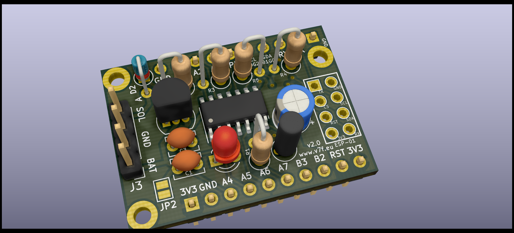

# Attiny84/16x4 and ESP-01 (ESP8266) KiCad PCB and example code

## Usage

The main function of the attiny is acting as a battery friendly low power co-processor for the ESP.
A bit like the ULP low power co-processor of the ESP32, except with a lot more IO functions and program memory.

Attiny and ESP combined use 12uA in sleep mode.

Usable on breadboard (AtTiny84: 9 rows high, leaves 3 rows empty and AtTiny16x4: 8 rows high) OR stand alone.

2 PCB designs: AtTiny84 PCB or AtTiny1604 / AtTiny1614

All components / features are optional:

- AtTiny84 or AtTiny1604 / AtTiny1614
- ESP-01 (When not used the connections/space can be used for any other (I2C) device)
- LED with resistor
- MCP1700 low quiescent current regulator
- BAT85 diode for Solar Charging panel (see https://www.thethingsnetwork.org/labs/story/a-cheap-stm32-arduino-node/step/solar-power)
- Voltage divider for measuring battery voltage
- Decoupling capacitors
- I2C communication between ESP and Attiny (with optional 4k7 pull-up)
- AtTiny can restart ESP by pulling ESP Reset low

## Example code

The attiny wakes up the ESP every 10 minutes by pulling RST low and sends a counter and the supply voltage to it.

### OTA for the ESP
OTA for ESP program updates is activated for 20s when the I2C communication fails.
This can be triggered by resetting the ESP by pulling the RST line low.
Because the attiny is most of the time sleeping
the I2C communication will fail.

There is a small chance that the attiny will reset the ESP during upload when the 10 minute interval is completed.
You can prevent this by pulling the Attiny RST low when using OTA, or just upload again.

## Schemas

https://github.com/tomtor/ESPTiny/raw/master/ESPTiny.pdf

https://github.com/tomtor/ESPTiny/raw/master/ESPTiny1614.pdf

## Credits

https://github.com/jdunmire/kicad-ESP8266
