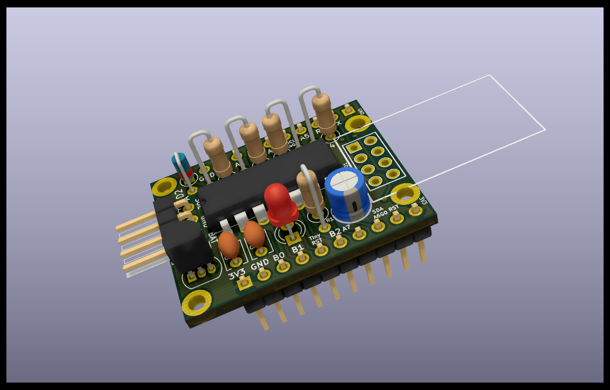

# Attiny84 and ESP-01 (ESP8266) KiCad Design

Usable on breadboard (9 rows high, leaves 3 rows empty) OR stand alone.

All components / features are optional:

- AtTiny84
- ESP-01
- LED with resistor
- MCP1700 low quiescent current regulator
- BAT85 diode for Solar Charging panel (see https://www.thethingsnetwork.org/labs/story/a-cheap-stm32-arduino-node/step/solar-power)
- Voltage divider for measuring battery voltage
- Decoupling capacitors
- I2C communication between ESP and Attiny (with optional 4k7 pull-up)
- AtTiny can restart ESP by pulling ESP Reset low

